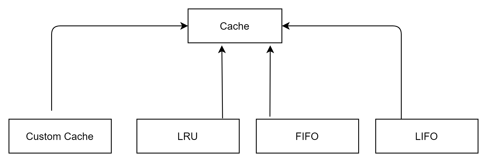

##### In-memory Cache

###### Cache has two fields :
1. Storage
2. Eviction Policy

###### Storage
    Storage used for storing key value pair is Hashmap.

###### Eviction Policy
    Each Eviction Policy has 3 methods and we have used Doubly Linked List to implement eviction policy.
1.  **keyPut** : This method tells what is supposed to be done when a key is put in Cache.
2.  **keyAccessed**: This method tells what  is supposed to be done when a key is accessed from Cache.
3.  **evictKey**: This method tells which key should be deleted when cache reaches its limit and return the key.

###### LRU Eviction Policy
1.  **keyPut** : When key is put then it is added in last position of the doubly linked list.
    
2.  **keyAccessed**: When any key is accessed then it removed it from original position and added in the last position of linked list.
    
3.  **evictKey**: When storage get full then first element in the Doubly linked list is removed.

###### FIFO Eviction Policy

1.  **keyPut** : When key is put then it is added in last position of the doubly linked list.

2.  **keyAccessed**: Do Nothing

3.  **evictKey**: When storage get full then first element in the Doubly linked list is removed.

###### LIFO Eviction Policy

1.  **keyPut** : When key is put then it is added in last position of the doubly linked list.

2.  **keyAccessed**: Do Nothing

3.  **evictKey**: When storage get full then last element in the Doubly linked list is removed.

###### How to use Cache as Library
**LRU**

        LRUCache<Integer, String> myCache = new LRUCache<Integer,String>(10);  
        myCache.put(1, "test1"); 
        String value = myCache.get(1);
**FIFO**

        FIFOCache<Integer, String> myCache = new FIFOCache<Integer,String>(10);
        myCache.put(1, "test1");
        String value = myCache.get(1);
**LIFO**

        LIFOCache<Integer, String> myCache = new LIFOCache<Integer,String>(10);
        myCache.put(1, "test1");
        String value = myCache.get(1);

**CustomCache**

        First create a new evictionPolicy class by implementing EvictionPolicy Interface. 
        Suppose we have created CustomEvictionPolicyForTest class.

        To create customCache

        Cache<String, String> myCache = new CustomCache<String,String>(10, new CustomEvictionPolicyForTest<String>());
        myCache.put("1", "test1");
        String value = myCache.get("1");
        
        
 Please refer Unit Test Cases for more clearity.

    
